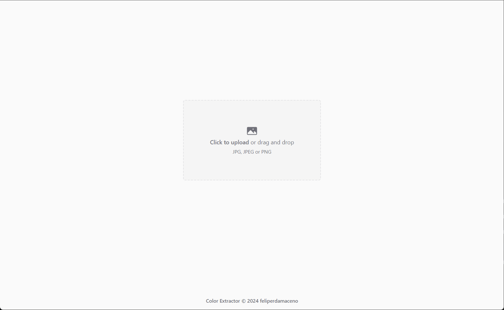

## Color Extractor

This project is a study case of FastAPI, demonstrating the creation of a simple color extractor API. The API utilizes the `colorgram.py` package to extract colors from an image sent via POST request from the client. Upon calling the API, the result is a list of 5 Python dictionaries, each containing the RGB values of the extracted colors.

## Features

- Extracts colors from an image using the FastAPI framework.
- Utilizes the `colorgram.py` package for color extraction.
- Provides a simple UI for uploading images and sending them to the server via POST requests.
- Displays a loading spinner during image processing on the server.
- Presents the extracted colors to the user using 5 color pickers in the UI.

## API Endpoints

- POST /api/extract/rgb: Accepts an image file (JPG, JPEG, PNG) as input and returns a JSON response containing the extracted colors in RGB format.

## Client-Side

The UI allows users to:

- Upload an image to the server for color extraction.
- Display a loading spinner while the server processes the image.
- Receive the extracted colors displayed as 5 color pickers in the UI.

## Getting Started

1. Clone the repository.
2. Set up the environment variables in a **.env** file.
3. Run `python scripts/build.py` to build your static files.
4. Start the server with `python scripts/serve.py`.

\* If you're on windows, use `python3` instead of `python` on your CLI to execute the commands.

## Environment Variables

Ensure the following variables are set on your development environment:

**VITE_API_URL**: API URL from your local python server.

## Licence

This is an open-source project and is available under the [**MIT License**](LICENSE.txt). You are free to use, modify, and distribute the code in accordance with the terms of the license.

## Contributors

Contributions are highly appreciated! If you encounter any issues or have suggestions for improvements, please feel free to open an issue or submit a pull request.

[feliperdamaceno](https://github.com/feliperdamaceno)

## Contact me

Linkedin: [feliperdamaceno](https://www.linkedin.com/in/feliperdamaceno)
